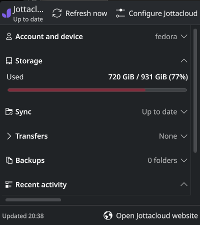
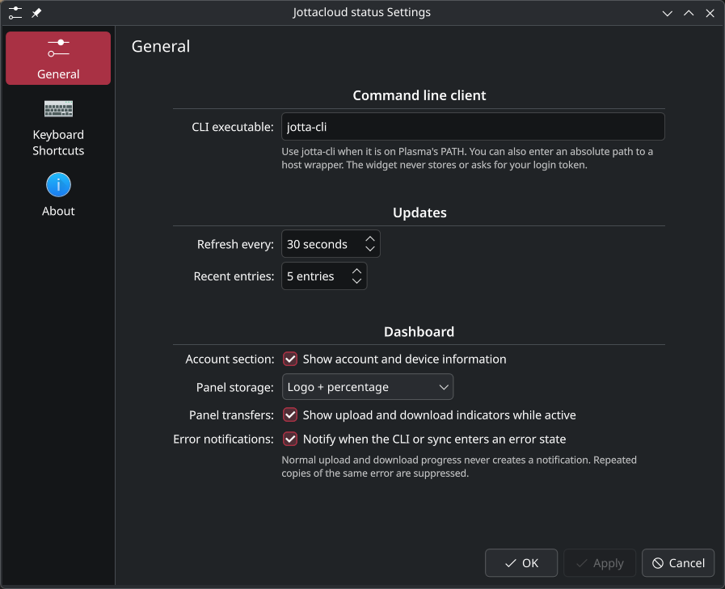

# Jottacloud status for KDE Plasma

A Plasma 6 widget for the installed `jotta-cli` client. It keeps narrow panel
placements compact, shows storage and active transfer details when panel space
allows, and uses an expanded dashboard on the desktop. The dashboard covers
account/device, storage, sync, transfers, read-only backups, activity, and
errors.

## Screenshots

The compact panel view shows the current status at a glance. Click it to open
the expanded dashboard, where the sections can be opened for more detail. The
configuration page controls the panel display mode and other widget options.






## Requirements

- Plasma 6 with `kpackagetool6`, `plasmawindowed`, and the
  `org.kde.plasma.plasma5support` QML module
- A logged-in `jotta-cli` client and its running `jottad` daemon
- Node.js 18+ for the pure logic tests
- `qmllint` for QML checks (optional, but recommended)

The widget does not authenticate, store tokens, start the daemon, change backup
folders, or use Jottacloud's private API. It only invokes the documented status,
list, log, and `syncpaused` commands.

## Install

```bash
./tools/check-environment.sh
./tools/install.sh
```

Add **Jottacloud status** from the panel's **Add Widgets** dialog. Restart
Plasma after changing `metadata.json`:

```bash
./tools/install.sh --restart
```

Build a distributable package with `./tools/package.sh`, or remove the widget
with `./tools/install.sh --remove`.

## Configuration

The default CLI command is `jotta-cli`, resolved in the Plasma environment. If
the command is not on that PATH, set an absolute executable or wrapper path in
the widget configuration. The command must be non-interactive and must already
have access to the user's normal Jottacloud daemon/authentication.

For a container-backed setup, the wrapper must work outside an interactive
shell and use executable paths that are valid in the Plasma environment. Verify
the configured command independently before adding the widget:

```bash
jotta-cli status --json
```

The widget reports a missing executable or daemon as unavailable/offline and
keeps the last good dashboard snapshot when possible.

The configuration page can set the compact panel to logo only, logo plus
percentage, or percentage plus size and sync status, and can hide active
transfer indicators. Storage uses binary units such as `GiB`; the expanded
dashboard shows both used/capacity and a percentage when the account reports a
finite capacity. The install script also registers the packaged Jottacloud mark
in the user icon theme so it can be used by Plasma's Add Widgets view.

## Development

Pure parsing, state, formatting, command safety, and error deduplication tests:

```bash
node --test tests/*.test.mjs
```

QML lint and runtime checks must run on the Plasma host:

```bash
for file in contents/ui/*.qml contents/config/config.qml; do
    qmllint --unqualified disable -I "$(qtpaths6 --query QT_INSTALL_QML)" "$file"
done
plasmawindowed io.github.oal.jottacloud-kde
```

The executable data engine is intentionally kept in `contents/ui/CliTransport.qml`.
It serializes commands, captures stdout/stderr, applies a timeout, and ignores
late callbacks. `contents/helper/exec-cli` limits the data engine's shell
boundary to launching a fixed helper, then invokes the configured CLI directly
with argv. The domain modules under `contents/code/` have no Qt dependency,
which keeps the important behavior testable without Plasma.

## License

MPL-2.0. See `LICENSE`.
